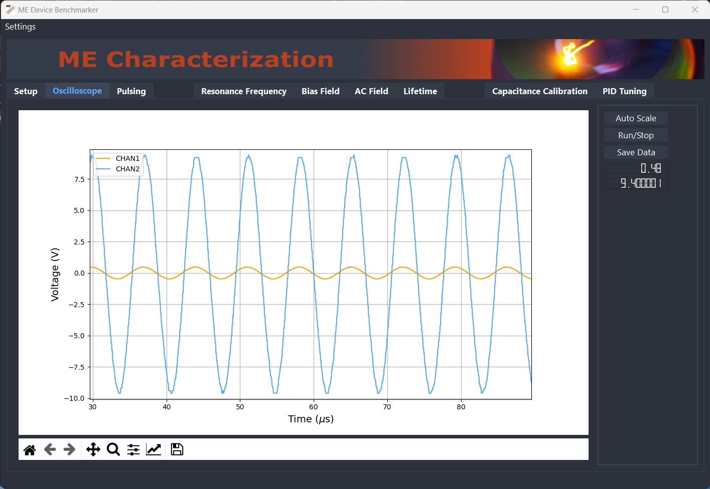
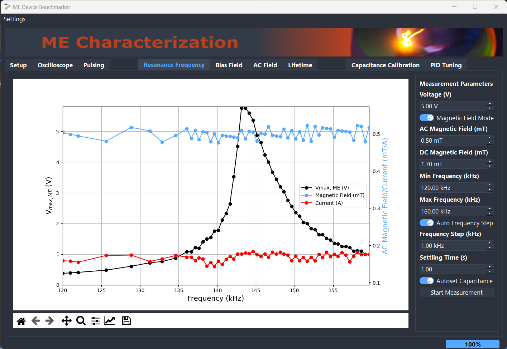
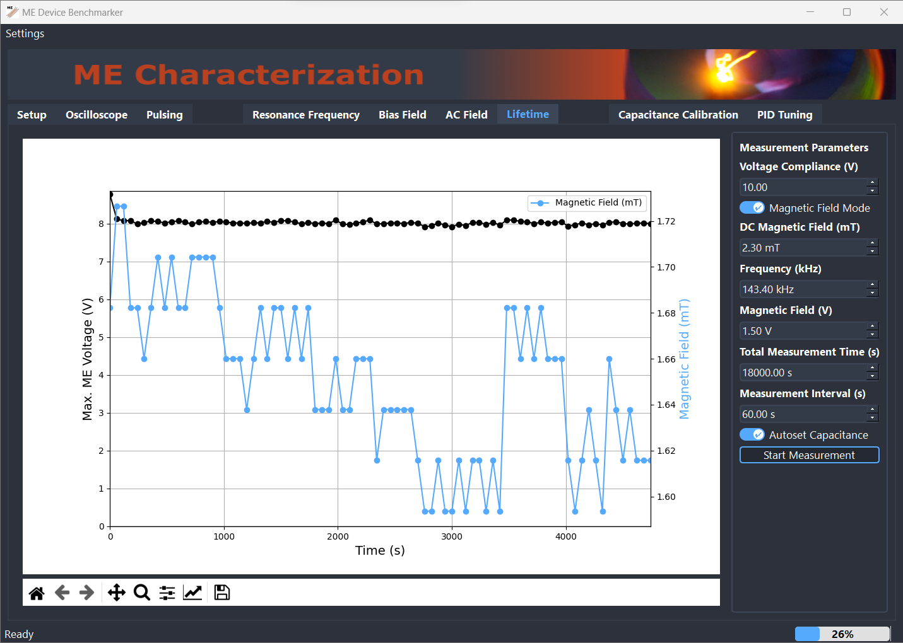

<h1 align="center">
    Magnetoelectric Device Characterisation
</h1>

<p align="center">
   <a href="https://github.com/GatherLab/me-measurement/commits" title="Last Commit"></a>
   <a href="./LICENSE" title="License"></a>
</p>

Software that interfaces several hardware components (listed below) used for the
generation of AC and DC magnetic fields to characterize and drive
magnetoelectric transducers as outlined in _Butscher et al._ (-doi-).

## Setup

### Hardware

| Item                                                                 | Brand   | Model Number              |
| -------------------------------------------------------------------- | ------- | ------------------------- |
| Oscilloscope                                                         | Rigol   | DS1202 Z-E (1000Z Series) |
| Two channel power source                                             | Korad   | KA33005P                  |
| Arduino nano                                                         | Arduino |                           |
| SI5351A based function generator with IR2213 based class-D amplifier |         |                           |
| Variable capacitor relays interfaced with Arduino                    |         |                           |

### First Installation

1. Clone project folder to local machine
2. Generate virtual environement
   ```terminal
   py -m venv venv
   ```
3. Activate virtual environment
   ```terminal
   Set-ExecutionPolicy Unrestricted -Scope Process
   .\venv\Scripts\activate
   ```
4. Install required python packages in a virtual environment from requirements.txx using
   ```
   pip install -r requirements.txt
   ```
5. Install IVI core components (e.g. https://www.ni.com/ivi/ivi_prod.htm)
5. DS1000Z IVI DriverInstall Ultra Sigma from the Rigol website (https://www.rigolna.com/download).
7. Install driver and testing software for KORAD 33005P (both can be downloaded in a single file https://www.koradtechnology.com/companyfile/6/#c_portalResCompanyFile_list-16495041742074581-2).
8. Install Arduino IDE and flush /arduino_sketch/frequency-generator-SI5351.ino to the Arduino nano and connect to function generator and capacitor board.
9. Connect all devices using USB ports to the computer and execute software

## User Journey

### Setup

Start software to make sure all devices are recognized. The loading window will
inform about devices that are not correctly recognized. Make sure the hardware
parameters are correctly entered in /usr/global_settings.json.

<p align="center">
  
</p>

If not already done, enter the device parameters such as AC coil inductance,
capacitance values via the GUI to the settings or /usr/global_settings.json.

### Calibration

**Calibrate capacitance** values using the calibration tab.
Select sensible parameters to e.g. obtain RLC resonances with reasonable
overlap. The software will automatically calculate and decide for the closest LC
combination.

<p align="center">
  
</p>

### Manual mode, Pulsing, Oscilloscope Interface

The easiest way of using the software is via the **setup tab**, where the AC and DC
magnetic fied and capacitance can be controlled manually. Set a folder path
where all measurements are saved and define file names to recognize your files
in the future.

<p align="center">
  
</p>

Directly interface the response from the **oscilloscope** and save the raw data
to the PC. The **pulsing** tab allows pulsing sequences, written to a separate
.txt file, to be exectued.

<p align="center">
  
  
</p>

### Device Charracterization

Fully characterize the actual magnetoelectric device using automatic **frequency scan**,
**bias field scan**, **hf field scan** and **lifetime** measurements.
Using an additional pick-up coil, the AC magnetic field is automatically
adjusted during the measurement to the desired constant value.

<p align="center">
  
  
</p>
<p align="center">
  
  
</p>

The PID parameters used for automatic adjustment can be set via the settings.
For a simple test and further adjustment of the tuning of the parameters the PID
tab can be used.

<p align="center">
  
</p>

&copy; Software developed by Julian Butscher @GatherLab, University of St
Andrews and University of Cologne. Please get in touch for further information.
